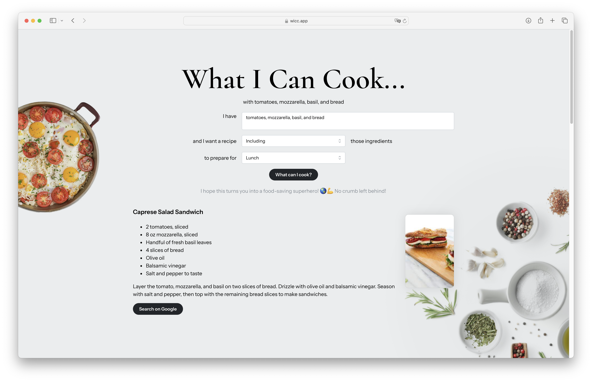
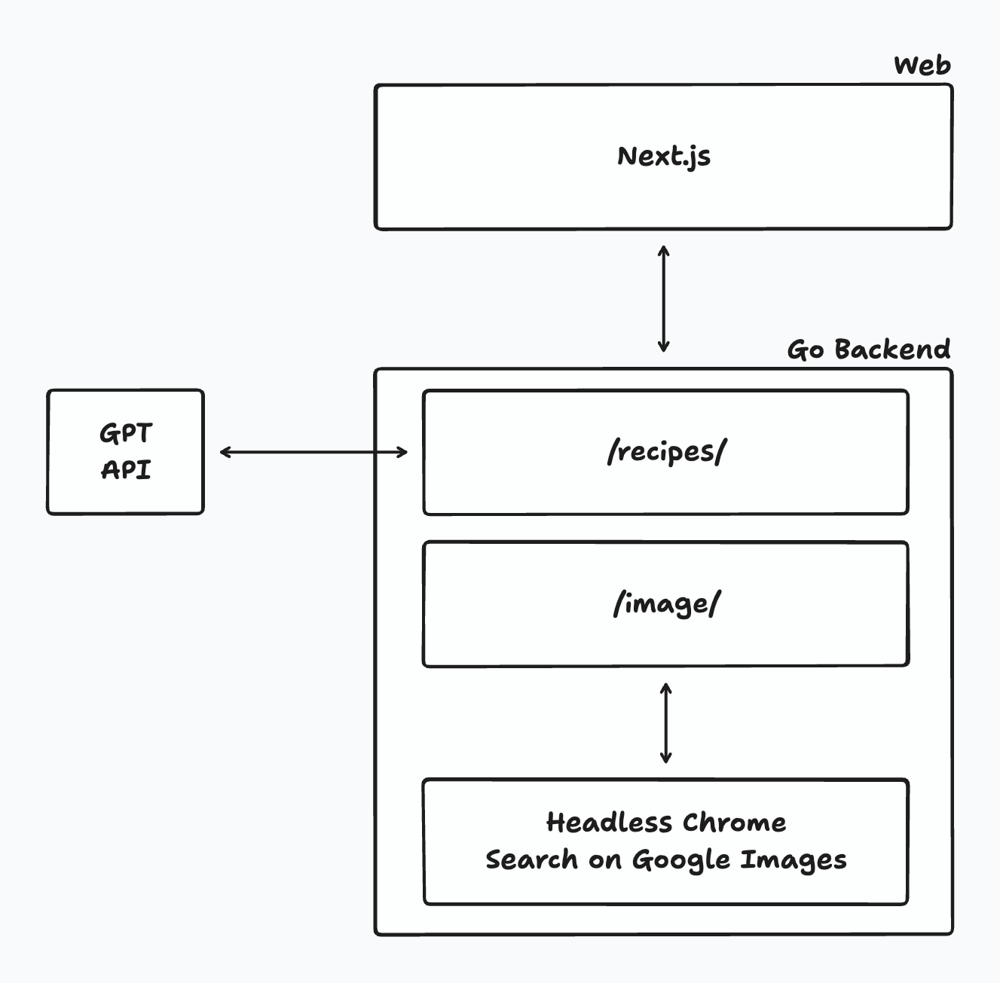
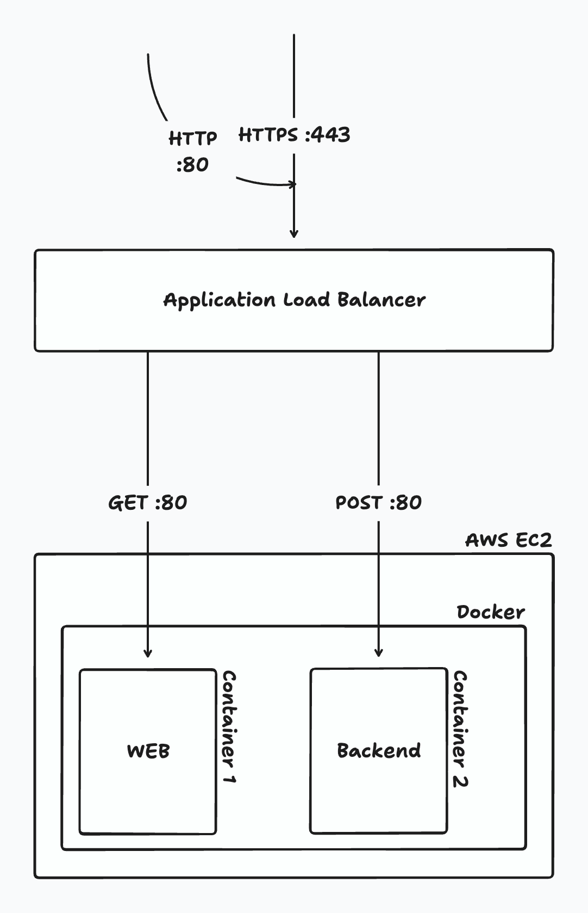

# WICC
## What I Can Cook
with..

### Description
How many times you have a bunch of, probably incoherent, ingredients in your fridge and you would like to save them from expiration?

This is why I made wicc.

Write the ingredient on the box and click on `What Can I Cook?`, you'll receive up to 5 recipes with ingredients and steps, an image of the plate and a button to search it on Google.

### Architecture
One Next.js app serving as frontend and a simple Go server for recipes search.
The Go server contains an instance of go-rod for headless browser navigation to Google image to get a picture of the recipe.

### Infrastructure
EC2 with Docker, ALB for SSL redirecting HTTPS requests to the Next.js app and POST requests to port 8080 and the Go server.

